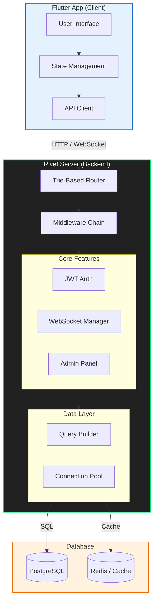

# Rivet Architecture

## Key Components
1.  **Trie-Based Router:** O(path_length) matching for blazing speed.
2.  **Middleware Chain:** Global and route-specific processing (Auth, CORS, Logging).
3.  **Isolate Cluster:** Multi-core processing for high throughput.
4.  **Native Compilation:** AOT compiled binary for instant startup.
